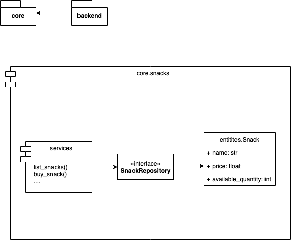

# Snacks Machine

Máquina de Salgadinhos.

## Decisões de Arquitetura

### Desenho geral

O sistema é dividido em dois grandes módulos: `core` e `backend`.

`core` é o módulo base do sistema, responsável por todas as regras de negócio e completamente desacoplado de tecnologias ou interfaces específicas. 
Por exemplo, esse módulo não conhece nada a respeito de protocolos HTTP ou sobre como interagir com banco de dados.

`backend` é o módulo do sistema responsável por toda a interface web e por implementar soluções de persistência dos dados (se necessário).

Essa separação de responsabilidades é construída aplicando os princípios SOLID, principalmente o Princípio de Substituição de Liskov e o Princípio de Inversão de Dependências.
A relação entre todos os módulos do sistema pode ser entendida através de 3 tipos de relações. Essas relações representam a arquitetura definida para o sistema:
* Relação entre os componentes de um módulo do `core`. Por exemplo, os elementos dentro de `core.snacks`.
* Relação entre os diferentes módulos dentro do módulo `core`. Por exemplo, como os módulos `core.snacks` e `core.currency` se relacionam.
* Relação entre um módulo do `backend` com o módulo correspondente em `core`. Por exemplo, como `backend.snacks` e `core.snacks` interagem.

#### Componentes dentro de um módulo do pacote core

A organização de cada módulo do pacote `core` segue uma estrutura baseada em 3 grupos de classes ou funções: Entidades, Repositories, Services e Exceptions.

Outros módulos podem ser criados para auxiliar esses módulos base de acordo com a necessidade. Seguindo a orientação "flat is better than nested" do Zen of Python, todos esses arquivos estão no mesmo nível. Caso a quantidade deles aumente, é possível reorganizá-los agrupando em módulos de acordo com as responsabilidades.

* `entities.py`
  * Entidades responsáveis por representar os dados fundamentais que modelam as regras de negócio.
  * O tráfego dos dados (por exemplo, passagem de parâmetros) entre os módulos é feito através dessas entidades.
* `repositories.py`:
  * Define a interface através da qual o sistema obtém as Entidades salvas ou realiza a persistência dos dados necessários.
  * Para fins de teste ou prototipação, o  módulo core pode definir Repositories simples que fazem armazenamento dos dados em memória.
* `services.py`
  * Define e implementa todas as regras de negócio (use cases) esperados para o sistema.
  * Depende apenas das Entidades definidas em `entities.py` e do Repository Abstrato (equivalente a uma interface) definido em `repositories.py`.
* `exceptions.py`
  * Define as exceções específicas do módulo implementado.
  * Seguindos as boas práticas do Python, essas exceções serão utilizadas para controle de fluxo pelos módulos que dependem do `core`. 

#### Relação entre os módulos core

* `currency.py`
  * Responsável por todos os dados e operações referentes a moeda. Isso inclui operações de pagamento e troco.
  * Não conhece nada sobre snacks.
* `snacks.py`
  * Responsável por todos os dados e operações referentes a snacks.
  * Para qualquer operação relacionada a dinheiro, utiliza o módulo `currency`. 

Snacks dependem da moeda (`Currency`) e não o contrário, porque a moeda é uma entidade mais elementar e pode ser utilizada em outras aplicações.

### Relação entre backend e core

* `backend.<x>.repositories`
  * Define uma ou mais implementações concreta para a interface definida em `core.<x>.repositories`
  * A implementação definitiva do Repository pode evoluir conforme as necessidades reais do sistema. Por exemplo:
     * Armazenamento em memória
     * Armazenamento em arquivo de texto
     * Armazenamento em banco de dados local
     * Armazenamento em banco de dados remoto.
     
* `backend.<x>.services`
  * Define uma implementação de Repository como padrão
  * Atua fazendo algo próximo a um [currying](https://en.wikipedia.org/wiki/Currying) das funções em `core.<x>.services`. Se necessário, pode mudar um pouco a assinatura da função apenas para se aplicar melhor ao contexto do backend (por exemplo, um argumento `snack: Snack` pode virar `snack_name: str`).    

* `backend.<x>.views`
  * Camada responsável por implementar os endpoints, tratando o request HTTP e retornando a resposta adequada.
  * Única camada ciente do contexto web do backend
  * Para tratar casos de exceção, utiliza as exceções definidas em `core.<x>.exceptions` para fazer o controle de fluxo e retornar o status code adequado para cda situação. 
    

## Infraestrutura necessária

Na configuração atual do sistema, o deploy em produção depende apenas de um servidor capaz de rodar um container Docker. Na AWS, isso poderia ser obtido serviços como o ECS, EKS, EB ou mesmo um EC2 simples. 

Para fins de prototipação, minha sugestão seria utilizar um EC2 e criar um script para atualizar o container rodando lá quando necessário. 
Para fins de implantação em produção, minha sugestão seria a implantação através de serviços orquestrados como o EKS. Serviços como ECS ou EKS permitiriam a escala horizonal e vertical do sistema sem grandes problemas, bem como a adição de novos serviços.

### Camada de persistência

Caso seja implemetada uma camada de persistência de dados em banco de dados, como o MySQL, poderia ser utilizado um serviço como o RDS. Esse serviço seria adequado que utilizar direto um container com MySQL pois já fornece funcionalidades como backup agendado e restauração a partir de snapshots. 

No código, as únicas alterações necessários seriam a implementação de um `DatabaseCashRepository(CashRepository)` e o ajuste nas configuração do *Django* para apontar para esse banco. Apenas o pacote `backend` seria alterado, nenhuma alteração em `core` é necessária.   

Observação: A camada de persistência atual (em memória ou no dentro próprio container da aplicação) não permite a escala horizontal do sistema, mas pode ser facilmente extendida para permitir.

## Hipóteses Assumidas
* A máquina possui uma quantidade limitada de moedas e notas. 
  * Essa quantidade varia conforme os usuários interagem com a máquina.
  * Caso não seja possível fornecer o troco adequado para o usuário, todo dinheiro inserido pelo usuário deve ser devolvido.
* Para fins de prototipação, não é críticao considerar aspectos de segurança como autenticação de usuários ou proteção contra CSRF.

## Melhorias Possíveis

* Implementar o `CashRepository` utilizando um sistema de persistência que não seja em memória, e que permita escalabilidade da aplicação (como um banco de dados)

* O `CashAmount` não faz uso otimizado da memória pois armazena cada nota/moeda como um objeto diferente em uma lista. Essa otimização pode ser feita de duas formas (simultaneamente):  
  * Em vez de armazenar uma lista com todas as notas/moedas, armazenar apenas a quantidade de cada tipo e nota/moeda.
  * Além disso, tranformar cada objeto `Cash(2), Cash(.5), ...` em um Singleton correspondente a cada valor.
  
* O banco de dados utilizado pelo backend é um SQLite. Pode-se utilizar o MySQL caso seja necessário um banco de dados em produção. Utilizando docker compose é possível testar essa solução sem adicionar nenhuma dificuldade ao setup do ambiente de desenvolvimento.

## Requisitos ainda não atendidos

* Tratar mais casos de contorno da API (por exemplo, comprar salgadinho sem estoque disponível)
* Fazer o reset da máquina
* Publicação da API em ambiente remoto (GCP ou AWS)
* Apesar da máquina de snacks ser utilizada por um usuário de cada vez, considero adequado garantir mais confiabilidade às operações de compra implementando uma ferramenta para que todas os passos da transação ocorram de forma atômica. Por exemplo: 
  * Isso pode ser feito criando um gerenciador de contexto nos repositories e utilizando eles nos métodos dos services.
  * Outra solução seria utilizar uma abordagem funcional e criar uma função no repository que recebe uma função qualquer e a executa de forma atômica.     
    